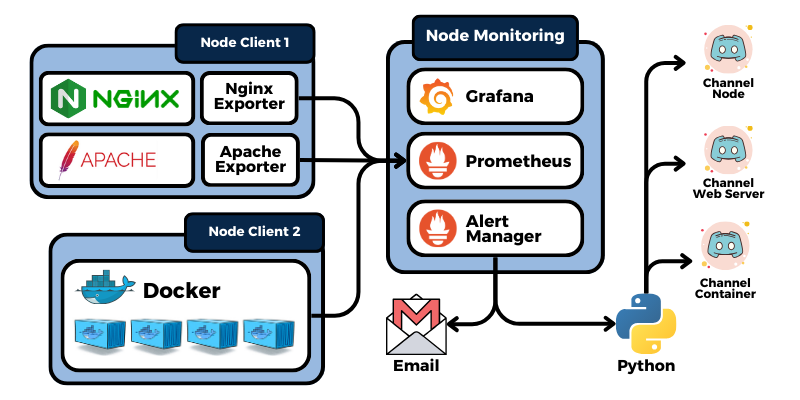
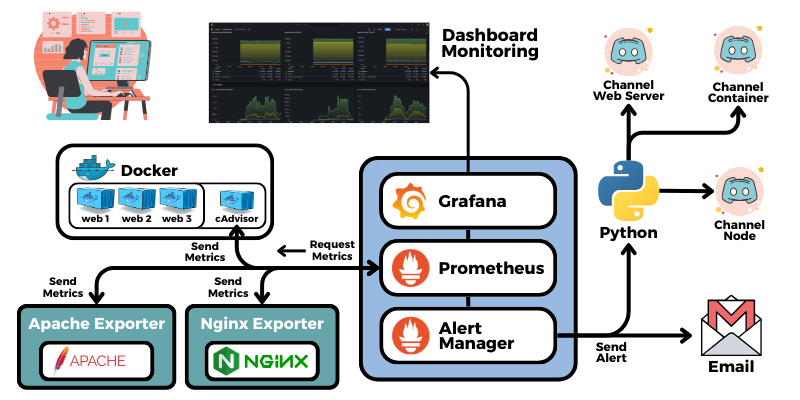
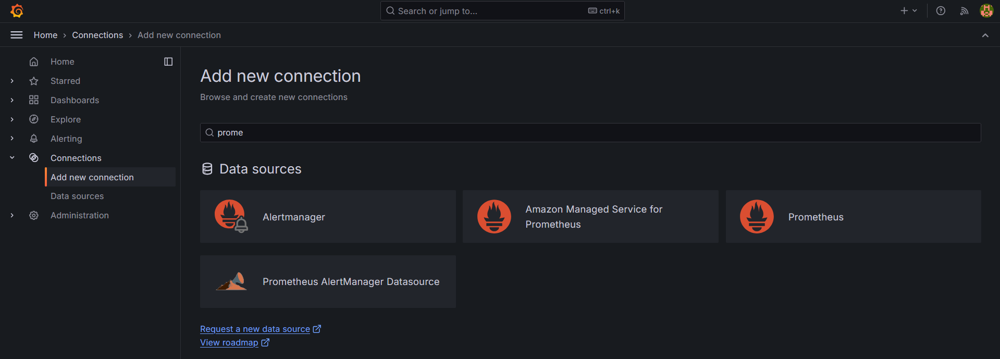
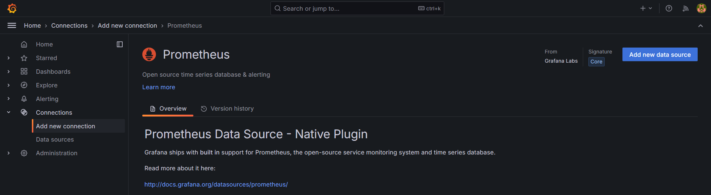
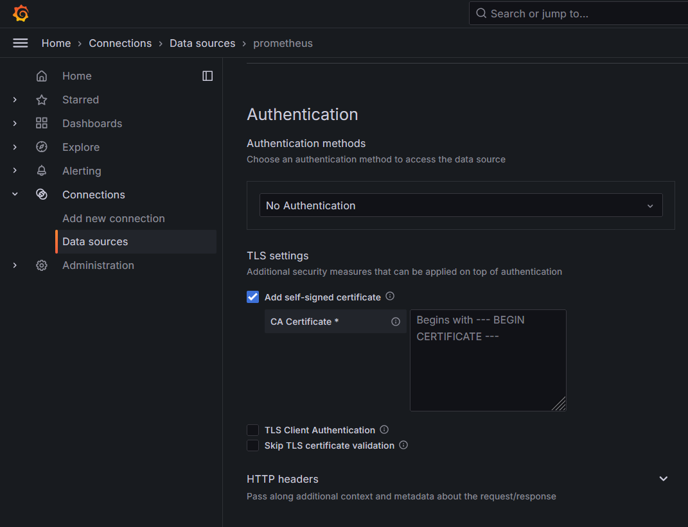
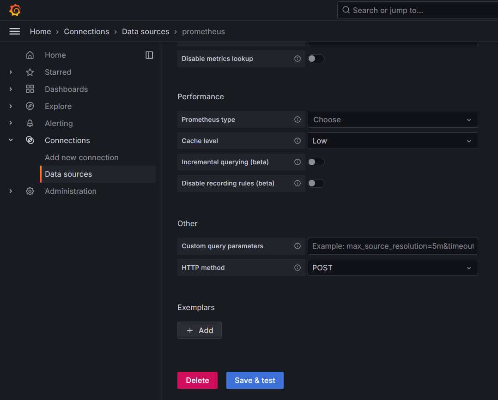
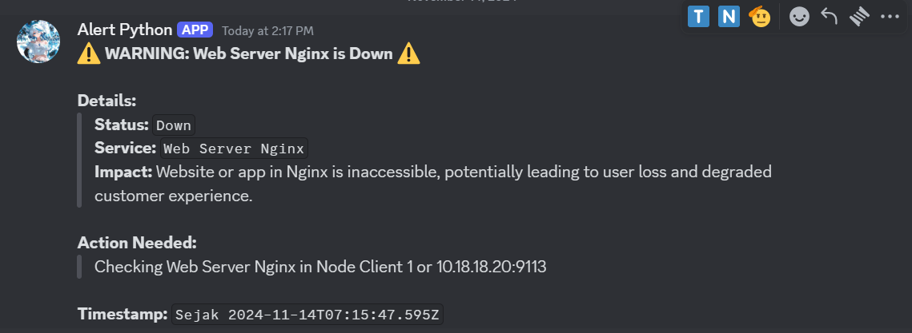
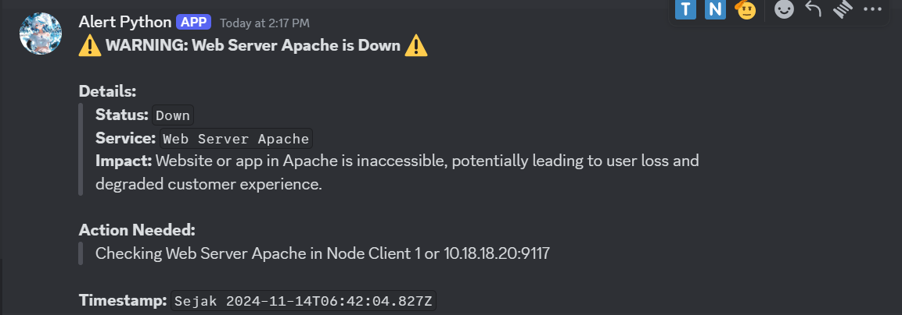
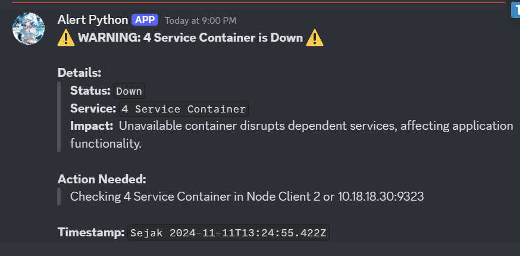
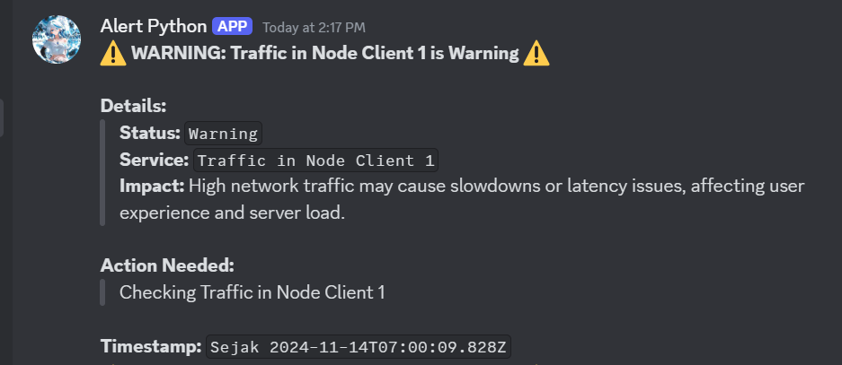

Di zaman modern sekarang yang serba otomatis serta kebutuhan akan monitoring atau pengecekan secara berkala, membuat kebutuhan akan tools automation monitoring yang canggih tanpa adanya campur tangan manusia untuk pengambilan data yang di monitoring tersebut, seperti penggunaan CPU, memory, disk atau traffic jaringan, menjadi semakin meningkat. Prometheus adalah salah satu solusi akan hal tersebut, yang menyediakan cara monitoring real time tanpa perlu adanya campur tangan manusia saat mengambil data yang harus di monitoring.

Dan dibutuhkan juga tools untuk visualisasi agar memudahkan dalam melakukan monitoring suatu system, aplikasi maupun server, Grafana disini berperan sebagai tools visualisasi yang sangat popular, karena kemampuannya dalam menangani visualisasi dengan banyak tools lain, sehingga lebih fleksible.

Serta dibutuhkan juga Alerting agar dapat memberikan peringatan dini terkait semisal adanya ganguan pada system yang menyebabkan system down, atau semisal ada terkait ancaman Cyber crime seprti DoS atau DDoS. Alert Manager Prometheus yang mengambil peran ini, yang nantinya akan mengirimkan peringatan apabila terjadi hal – hal tadi, sehingga meminimalisir terjadinya kerusakan pada system atau aplikasi kita. Alert Manager sendiri dapat di integrasikan dengan beberapa tools untuk notifikasi lain seperti Discord, Email atau WebHook Endpoint. Sehingga lebih fleksible dalam penggunaan alerting nya.

## Tools yang Digunakan.
- **Prometheus – 2.48.1**
- **Grafana – 11.2.2**
- **Alert Manager – 0.26.0**
- **Node Exporter – 1.8.2**
- **Nginx – 1.10.0**
- **Nginx Exporter – 0.11.0**
- **Apache2 – 2.4.52**
- **Apache Exporter – 1.0.3**
- **Docker – 27.3.1**
- **cAdvisor**
- **Python – 3.10.12**
- **Discord**
- **Email**

## Topologi

.

## Alur kerja



### Prometheus

Prometheus adalah salah satu tools monitoring system yang berbasis Cloud yang open source, yang lebih berfokus pada pengelolaan metrics dari suatu aplikasi atau system. Metrics sendiri merupakan data angka yang menunjukan performa atau nilai kinerja suatu aplikasi atau system. 

### Grafana

Grafana merupakan salah satu tools berbasis Web untuk data analitik dan data visualisasi yang interaktif dan real time, dengan kemampuan integrasi ke banyak tools lain, seperti prometheus, Loki Promtail, AWS IoT SiteWise, Apache Cassandra dan banyak lagi. Dengan kemampuannya tersebut membuat Grafana lebih fleksible, tidak hanya untuk satu atau dua tools saja. Grafana sendiri open source.

### Prometheus Alert Manager

Prometheus Alert Manager merupakan suatu tools yang berguna sebagai peringatan atau alerting, yang dimana nantinya, alert manager ini akan menerima data dari Prometheus, misalkan ada layanan atau aplikasi yang Down, yang nantinya akan di teruskan ke alert manager lalu mengirim ke layanan notifikasi seperti Email, Slack, atau Discord dan masih bayak lagi.

### Apache

Apache adalah salah satu software web server gratis dan open source, yang memungkinkan pengguna mengupload website nya ke internet. Apache sendiri sudah hampir menjadi platform website bagi kurang lebih 33% website di dunia, dengan nama resmi “Apache HTTP Server”. Apache pertama kali dirilis pada tahun 1995 dan dikelola oleh “Apache Software Foundation”.

### Nginx

NGINX (Engine-X) adalah salah satu web server yang banyak digunakan untuk membuat suatu website, dan digunakan hampir 34% dari seluruh website yang ada di internet. Nginx memiliki daya tarik karena sifatnya sebagai server HTTP, Reverse proxy, dan load balancer.

### Container

Container adalah sebuah unit yang mengemas code dan semua dependensinya. Sehingga dapat berjalan atau berpindah environment dengan lebih cepat dan efisien. Container tersebut sangat ringan tidak seperti Virtual Machine (VM) yang memerlukan OS untuk setiap VM nya, karena dalam container hanya berisikan source code dan dependensinya saja, jadi memungkinkan menginstal apa yang di perlukan saja.

### Docker

Docker adalah salah satu platform software yang digunakan untuk membuat, mengelola aplikasi yang nantinya dikemas dalam sebuah wadah yang terisolasi yaitu container. Docker nantinya akan mengemas aplikasi berserta dependensi yang diperlukan dalam satu paket yang ringan. Sehingga dapat dijalankan secara konsisten tanpa mengubah konfigurasi.

### Exporter Prometheus

Exporter Prometheus adalah suatu tools yang digunakan untuk mengubah data metrics dari suatu layanan aplikasi atau sistem yang tadinya tidak bisa di baca oleh Prometheus menjadi bisa di baca, bertindak sebagai perantara untuk layanan yang di pantau dengan Prometheus.

### CAdvisor

Cadvisor (Container Advisor) adalah suatu tools yang digunakan untuk memonitoring atau memantau performa / kinerja dari suatu container, serta mengambil data metrics dari Container, seperti penggunaan CPU, Memory, Traffic jaringan atau Disk I/O dari setiap container yang ada.

### SSL (Secure Sockets Layer)

SSL merupakan Protocol keamanan yang digunakan untuk mengenkrip si data seperti informasi pribadi, password, rekening, dan data lain yang bersifat sensitif, saat data dikirim kan ke server, data tersebut akan di enkripsi untuk menjaga keamanan dari data tersebut. SSL sertifikat yaitu sertifikat digital digunakan untuk autentikasi indentitas dari situs web yang memungkinkan koneksi enkripsi yang aman. Dan sering digunakan untuk menjaga keamanan data pengguna yang perlu memverifikasi kepemilikan situs website. 

1. Konfigurasi SSL Certificate untuk layanan

&nbsp;&nbsp;\- Buat directory untuk menyimpan CA di dalam directory “/etc/ssl/” agar lebih rapi serta mudah di identifikasi.

<p style="text-indent: 2em;">\- Buat file IP SAN untuk setiap Server / Node.</p>p>
    - Buat Certificate untuk beberapa layanan berikut :
      -  Prometheus
      -  Node Exporter
      -  Web Service dan Exporter Apache
      -  Client Web Server Apache
      -  Web Service dan Exporter Nginx
3. Install Node Exporter dan Konfigurasi SSL
4. Install dan Konfigurasi Apache dengan SSL

4\. Install dan Konfigurasi Nginx dengan SSL

5\. pass


## Implementasi
1. ###Konfigurasi SSL Certificate untuk layanan
&nbsp;&nbsp;a\. Buat directory untuk menyimpan CA di dalam directory **_“/etc/ssl/”_** agar lebih rapi serta mudah di identifikasi.

&nbsp;&nbsp;&nbsp;&nbsp;- Node Monitoring

  ```bash
  # Untuk Prometheus
  sudo mkdir -p /etc/ssl/prometheus
  sudo mkdir -p /etc/ssl/prometheus/cert/
  sudo mkdir -p /etc/ssl/prometheus/cert/<IP atau Domain dari Prometheus>/
  
  # Untuk Targets Prometheus
  sudo mkdir -p /etc/ssl/node_exporter/
  sudo mkdir -p /etc/ssl/apache_exporter/
  sudo mkdir -p /etc/ssl/nginx_exporter/
  ```
       
&nbsp;&nbsp;&nbsp;&nbsp;\- Node Client 1

       ```
       # Untuk Node Exporter
       sudo mkdir -p /etc/ssl/node_exporter/

       # Untuk Apache
       sudo mkdir -p /etc/ssl/apache/
       sudo mkdir -p /etc/ssl/apache/client/

       sudo mkdir -p /etc/ssl/nginx
       ```
     * Node Client 2
       ```
       # Untuk Node Exporter
       sudo mkdir -p /etc/ssl/node_exporter/
       ```
       
   - Buat file IP SAN untuk setiap Server / Node.
     ```
     sudo nano /etc/ssl/IP_SANS.txt

     subjectAltName=IP:<IP dari setiap Server / Node>
     ```
     
   - Buat Certificate untuk beberapa layanan berikut :
     * Prometheus
       ```
       sudo openssl genrsa -out /etc/ssl/prometheus/cert/10.18.18.10:9090/10.18.18.10:9090.key 2048
       
       sudo openssl req sha512-new \
         -subj "/C=IN/ST=jateng/L=kendal/0=Prometheus Najwan/OU=Prometheus Najwan/CN=Prometheus Najwan>" \
         -key /etc/ssl/prometheus/cert/10.18.18.10:9090/10.18.18.10:9090.key \
         -out /etc/ssl/prometheus/cert/10.18.18.10:9090/10.18.18.10:9090.csr

       sudo openssl x509 -req-sha512 days 3650 \
         -key /etc/ssl/prometheus/cert/10.18.18.10:9090/10.18.18.10:9090.key \
         -extfile /etc/ssl/IP_SANS.txt \
         -in /etc/ssl/prometheus/cert/10.18.18.10:9090/10.18.18.10:9090.csr\
         -out /etc/ssl/prometheus/cert/10.18.18.10:9090/10.18.18.10:9090.crt
       ```
       
     * Node Exporter
       ```
       sudo openssl genrsa -out /etc/ssl/node_exporter/node_exporter.key 2048
       
       sudo openssl req sha512-new \
         -subj "/C=IN/ST=jateng/L=kendal/0=Node Exporter Najwan/OU=Node Exporter Najwan/CN=Node Exporter Najwan>" \
         -key /etc/ssl/node_exporter/node_exporter.key \
         -out /etc/ssl/node_exporter/node_exporter.csr

       sudo openssl x509 -req-sha512 days 3650 \
         -key /etc/ssl/node_exporter/node_exporte.key \
         -extfile /etc/ssl/IP_SANS.txt \
         -in /etc/ssl/node_exporter/node_exporte.csr\
         -out /etc/ssl/node_exporter/node_exporte.crt
       ```
       
     * Web Service Apache2 dan Apache Exporter
       ```
       sudo openssl genrsa -out /etc/ssl/apache/apache.key 2048
       
       sudo openssl req sha512-new \
         -subj "/C=IN/ST=jateng/L=kendal/0=Apache Najwan/OU=Apache Najwan/CN=Apache Najwan>" \
         -key /etc/ssl/apache/apache.key \
         -out /etc/ssl/apache/apache.csr

       sudo openssl x509 -req-sha512 days 3650 \
         -key /etc/ssl/apache/apache.key \
         -extfile /etc/ssl/IP_SANS.txt \
         -in /etc/ssl/apache/apache.csr\
         -out /etc/ssl/apache/apache.crt
       ```
       
     * Client Web Server Apache2
       ```
       sudo openssl genrsa -out /etc/ssl/apache/client/client.key 2048
       
       sudo openssl req sha512-new \
         -subj "/C=IN/ST=jateng/L=kendal/0=Apache Najwan/OU=Apache Najwan/CN=Apache Najwan>" \
         -key /etc/ssl/apache/client/client.key \
         -out /etc/ssl/apache/client/client.csr

       sudo openssl x509 -req-sha512 days 3650 \
         -key /etc/ssl/apache/client/client.key \
         -extfile /etc/ssl/IP_SANS.txt \
         -in /etc/ssl/apache/client/client.csr\
         -out /etc/ssl/apache/client/client.crt
       ```
       
     * Web Service Nginx dan Nginx Exporter
       ```
       sudo openssl genrsa -out /etc/ssl/nginx/nginx.key 2048
       
       sudo openssl req sha512-new \
         -subj "/C=IN/ST=jateng/L=kendal/0=Prometheus Najwan/OU=Prometheus Najwan/CN=Prometheus Najwan>" \
         -key /etc/ssl/nginx/nginx.key \
         -out /etc/ssl/nginx/nginx.csr

       sudo openssl x509 -req-sha512 days 3650 \
         -key /etc/ssl/nginx/nginx.key \
         -extfile /etc/ssl/IP_SANS.txt \
         -in /etc/ssl/nginx/nginx.csr\
         -out /etc/ssl/nginx/nginx.crt
       ```

### 2. Install Node Exporter dan Konfigurasi SSL
   - Install Package Node Exporter, lalu pindahkan ke directory **_"/etc"_**.
     ```
     wget https://github.com/prometheus/node_exporter/releases/download/ v1.8.2/node_exporter-1.8.2.linux-amd64.tar.gz
     sudo cp node_exporter-1.8.2.linux-amd64 /etc/node_exporter/
     ```
     
   - Buat file **_“config.yml”_** di directory **_“/etc/node_exporter”_** yang nantinya digunakan untuk koneksi ssl.
     ```
     tls_server_config:
       cert_file: /etc/ssl/node_exporter/node_exporter.crt
       key_file: /etc/ssl/node_exporter/node_exporter.key
     ```
     
   - Buat service, agar dapat berjalan di background.
     ```
     sudo /etc/systemd/system/node-exporter.service
     [Unit]
     Description=Node Exporter

     [Service]
     User=root
     ExecStart=/etc/node_exporter/node_exporter \
         --web.config.file="/etc/node_exporter/config.yml"
    
     [Install]
     WantedBy=default.target
     ```
     
   - Restart Daemon dan jalankan service Node Exporternya.
     ```
     sudo systemctl daemon-reload
     sudo systemctl start node-exporter.service
     sudo systemctl enable node-exporter.service
     sudo systemctl status node-exporter.service
     ```
     
### 3. Install dan Konfigurasi Apache dengan SSL
   - Install Package Apache2, dan Download Source Code untuk aplikasi **_[2048](https://github.com/gabrielecirulli/2048)_**.
     ```
     sudo apt install apache2 -y

     git clone https://github.com/gabrielecirulli/2048
     sudo cp 2048 /var/www/html/
     ```
     
   - Konfigurasi untuk mods SSL di Apache.
     ```
     sudo nano /etc/apache2/mods-available/ssl.conf

     SSLProtocol all -SSLv3 -TLSv1 -TLSv1.1 +TLSv1.2 +TLSv1.3

     sudo a2enmod ssl
     ```
     
   - Konfigurasi untuk web nya agar menampikan aplikasi yang sesuai.
     ```
     sudo nano /etc/apache2/sites-available/default-ssl.conf

     <VirtualHost_default_:443>
         ServerName 10.18.18.20
         DocumentRoot /var/www/html/2048

         SSLEngine on
         SSLCertificateFile      /etc/ssl/apache/apache.crt
         SSLCertificateKeyFile   /etc/ssl/apache/apache.key
         SSLCACertificateFile    /etc/ssl/apache/client/client.crt

         <Location "/server-status">
             SetHandler server-status
         </Location>
     ---
     sudo a2ensite default-ssl.conf
     ```
     
   - Restart layanan Apache2.
     ```
     sudo systemctl restart apache2.service
     sudo systemctl status apache2.service
     ```
     
### 4. Install dan Konfigurasi Nginx dengan SSL
   - Install Package Apache2, dan Download Source Code untuk aplikasi **_[Tic Tac Toe](https://github.com/Aklilu-Mandefro/javascript-Tic-Tac-Toe-game-app)_**.
     ```
     sudo apt install nginx -y

     git clone https://github.com/Aklilu-Mandefro/javascript-Tic-Tac-Toe-game-app)
     sudo cp javascript-Tic-Tac-Toe-game-app /var/www/html/
     ```
     
   - Konfigurasi untuk web nya agar menampikan aplikasi yang sesuai.
     ```
     sudo nano /etc/nginx/sites-available/default

     server {
           listen 443 ssl default_server;
           listen [::]: 443 ssl default_server;
     
           root /var/www/html/javascript-Tic-Tac-Toe-game-app/;
           index index.html;
     
           ssl_certificate      /etc/ssl/nginx/nginx.crt;
           ssl_certificate_key  /etc/ssl/nginx/nginx.key;
           ssl_protocols        TLSv1 TLSv1.1 TLSv1.2 TLSv1.3;
           ssl_ciphers          HIGH:!aNULL:!MD5;

           location / {
                 try_files $uri $uri/ =404;
           }
     
           location = /server-status {
                 stub_status on;
           }
     }
     ```
     
   - Restart layanan Nginx.
     ```
     sudo systemctl restart nginx.service
     sudo systemctl status nginx.service
     ```
     
6. Install Apache Exporter dengan SSL
  - Download Package Apache Exporter, lalu pindahkan ke directory **_"/etc"_**.
    
    ```bash
    wget https://github.com/Lusitaniae/apache_exporter/releases/download/v1.0.3/apache_exporter-1.0.3.linux-amd64.tar.gz

    tar xvzf apache_exporter-1.0.3.linux-amd64.tar.gz
    sudo cp apache_exporter-1.0.3.linux-amd64 /etc/apache_exporter
    ```
    
  - Buat file **_“config.yml”_** di directory **_“/etc/apache_exporter”_** yang nantinya digunakan untuk koneksi ssl.
    
    ```yaml
    tls_server_config:
       cert_file: /etc/ssl/apache_exporter/apache_exporter.crt
       key_file: /etc/ssl/apache_exporter/apache_exporter.key
    ```

  - Buat service, agar dapat berjalan di background.
    
    ```bash
    sudo /etc/systemd/system/apache-exporter.service

    [Unit]
    Description=Apache Exporter

    [Service]
    User=root
    ExecStart=/etc/apache_exporter/apache_exporter \
         --scrape_url="https://10.18.18.20:443/server-status?auto" \
         --web.config.file="/etc/apache_exporter/config.yml" \
         --insecure
    
    [Install]
    WantedBy=default.target
    ```
  - Restart Daemon dan jalankan service Node Exporternya.
    ```bash
    sudo systemctl daemon-reload
    sudo systemctl start node-exporter.service
    sudo systemctl enable node-exporter.service
    sudo systemctl status node-exporter.service
    ```
    
7. Install Nginx Exporter dengan SSL
  - Install Package Nginx Exporter, lalu pindahkan ke directory **_"/etc"_**.
    ```bash
    wget https://github.com/nginxinc/nginx-prometheus-exporter/releases/download/v0.11.0/nginx-prometheus-exporter_0.11.0_linux_amd64.tar.gz
    tar -xvzf nginx-prometheus-exporter_0.11.0_linux_amd64.tar.gz
    sudo cp nginx-prometheus-exporter_0.11.0_linux_amd64 /etc/nginx_exporter
    ```
     
  - Buat file **_“config.yml”_** di directory **_“/etc/nginx_exporter”_** yang nantinya digunakan untuk koneksi ssl.
  - 
    ```yaml
    tls_server_config:
       cert_file: /etc/ssl/nginx_exporter/nginx_exporter.crt
       key_file: /etc/ssl/nginx_exporter/nginx_exporter.key
    ```
     
  - Buat service, agar dapat berjalan di background.
    
    ```bash
    sudo /etc/systemd/system/nginx-exporter.service
     
    [Unit]
    Description=Nginx Exporter
    Wants=network-online.target
    After=network-online.target
     
    [Service]
    User=root

    ExecStart=/etc/nginx_exporter/nginx-prometheus-exporter \
         -nginx.scrape-uri=https://10.18.18.20:443/server-status
         -nginx.ssl-ca-cert="/etc/ssl/nginx/nginx.crt" \
         -web.secured-metrics=true \
         -web.ssl-server-cert="/etc/ssl/nginx/nginx.crt" \
         -web.ssl-server-key="/etc/ssl/nginx/nginx.key"
    
    [Install]
    WantedBy=default.target
    ```
     
  - Restart Daemon dan jalankan service Nginx Exporternya.
    
    ```bash
    sudo systemctl daemon-reload
    sudo systemctl start nginx-exporter.service
    sudo systemctl enable nginx-exporter.service
    sudo systemctl status nginx-exporter.service
    ```

8. Install Docker 
  - Menambahkan repository dari Docker.
    ```
    sudo apt-get update
    sudo apt-get install ca-certificates curl -y
    sudo install -m 0755 -d /etc/apt/keyrings
    sudo curl -fsSL https://download.docker.com/linux/ubuntu/gpg -o /etc/apt/keyrings/docker.asc
    sudo chmod a+r /etc/apt/keyrings/docker.asc
    echo "deb [arch=$(dpkg --print-architecture) signed-by=/etc/apt/keyrings/docker.asc] https://download.docker.com/linux/ubuntu $(. /etc/os-release && echo "$VERSION_CODENAME") stable" | sudo tee /etc/apt/sources.list.d/docker.list > /dev/null
    ```
  - Install Docker.
    ```
    sudo apt-get update
    sudo apt-get install docker-ce docker-ce-cli containerd.io docker-buildx-plugin docker-compose-plugin -y
    ```
  - Mengatur agar user **_“student”_** atau user biasa (Bukan Root) dapat menggunakan perintah docker
    ```
    sudo usermod -aG docker $USER
    sudo chmod 666 /var/run/docker.sock
    docker version
    ```
9. Install CAdvisor untuk Monitoring Container Docker
   ```
   docker run -d \
       --volume=/:/rootfs:ro \
       --volume=/var/run:/var/run:ro \
       --volume=/sys:/sys:ro \
       --volume=/var/lib/docker/:/var/lib/docker:ro \
       --volume=/dev/disk/:/dev/disk:ro \
       --publish=8080:8080 \
       --detach=true \
       --name=cadvisor\
       gcr.io/cadvisor/cadvisor:latest

   docker ps -a
   ```
10. Install dan Konfigurasi Prometheus dengan SSL
  - Download Package Prometheus.
    ```bash
    sudo su
    wget https://github.com/prometheus/prometheus/releases/download/v2.48.1/prometheus-2.48.1.linux-amd64.tar.gz
    tar xvfz prometheus-2.48.1.linux-amd64.tar.gz
    cp prometheus-2.48.1.linux-amd64/etc/prometheus
    ```
  - Buat file “web-config.yml” di directory **_“/etc/prometheus/”_**  yang nantinya digunakan untuk koneksi ssl
    ```yaml
    tls_server_config:
      cert_file: /etc/prometheus/certs/10.18.18.10:9090/10.18.18.10:9090.crt
      key_file: /etc/prometheus/certs/10.18.18.10:9090/10.18.18.10:9090.key
    ```
  - Lalu Edit di file **_/etc/prometheus/config.yml_** untuk menambahkan alerting ke AlertManager, Rules untuk Alerting, serta Targets yang akan di Pantau.
    ```yaml
    global:
      scrape_interval: 15s
      evaluation_interval: 15s
    
    alerting:
      alertmanagers:
        - static_configs:
            - targets:
              - 10.18.18.10:9093
    
    rule_files:
      - "rules-web-server.yml"
      - "rules-container.yml"
      - "rules-node.yml"
    
    scrape_configs:
      - job_name: "prometheus"
        scheme: https
        tls_config:
          ca_file: "/etc/prometheus/certs/10.18.18.10:9090/10.18.18.10:9090.crt"
        static_configs:
        - targets: ["10.18.18.10:9090"]
    
      - job_name: 'apache-exporter-client01'
        scheme: https
        tls_config:
          ca_file: "/etc/prometheus/apache/apache.crt"
        static_configs:
        - targets: ['10.18.18.20:9117']
    
      - job_name: 'nginx-exporter-client01'
        scheme: https
        tls_config:
          ca_file: "/etc/prometheus/nginx/nginx.crt"
          insecure_skip_verify: true
        static_configs:
        - targets: ['10.18.18.20:9113']
    
      - job_name: 'node monitoring'
        scheme: https
        tls_config:
          ca_file: "/etc/prometheus/node_exporter/node_exporter_monitoring.crt"
        static_configs:
        - targets: ['10.18.18.10:9100']
    
      - job_name: 'node client01'
        scheme: https
        tls_config:
          ca_file: "/etc/prometheus/node_exporter/node_exporter_client01.crt"
        static_configs:
        - targets: ['10.18.18.20:9100']
    
      - job_name: 'node client02'
        scheme: https
        tls_config:
          ca_file: "/etc/prometheus/node_exporter/node_exporter_client02.crt"
        static_configs:
        - targets: ['10.18.18.30:9100']
    
      - job_name: 'docker-node-client02'
        static_configs:
        - targets: ['10.18.18.30:9323']
    
      - job_name: 'cAdvisor-client02'
        static_configs:
        - targets: ['10.18.18.30:8080']
    ```
    
  - Buat Service agar dapat berjalan di Background.
    ```bash
    sudo nano /etc/systemd/system/prometheus_server.service
    
    [Unit]
    Description=Prometheus Server

    [Service]
    User=root
    ExecStart=/etc/prometheus/prometheus \
        --config.file=/etc/prometheus/config.yml \                                      --
        --web.external-url=https://10.18.18.10:9090/ \                                  --
        --web.config.file=/etc/prometheus/web-config.yml

    [Install]
    WantedBy=default.target
    ```
  - Restart Daemon dan jalankan Service Prometheus nya.
    ```bash
    sudo systemctl daemon-reload
    sudo systemctl start prometheus_server.service
    sudo systemctl enable prometheus_server.service
    sudo systemctl status prometheus_server.service
    ```
    
11. Install Grafana
  - Download Package Grafana, lalu pindahkan ke **_/etc_**.
    ```bash
    sudo su
    wget https://dl.grafana.com/oss/release/grafana-11.2.2.linux-amd64.tar.gz

    tar -zxvf grafana-v11.2.2.linux-amd64.tar.gz
    cp grafana-v11.2.2.linux-amd64/etc/grafana
    ```
  - Lalu buat service, agar dapat berjalan di background.
    ```bash
    [Unit]
    Description=Grafana

    [Service]
    User=root
    ExecStart=/etc/grafana/bin/grafana-server -homepath /etc/grafana/ web

    [Install]
    WantedBy=default.target
    ```
    
  - Restart Daemon dan jalankan Service Prometheus nya.
    ```bash
    sudo systemctl daemon-reload
    sudo systemctl start grafana.service
    sudo systemctl enable grafana.service
    sudo systemctl status grafana.service
    ```
  - Lalu konfigurasi agar Grafana dapat membaca data dari Prometheus. Ke bagian kiri pilih “Connections”  kemudian “Add new connection” , lalu pilih Data Source “Prometheus”.
    
    
  - Klik “Add new data source” di kanan atas.
    
    
  - Kemudian isi nama “Data Source” dan “Connection – Prometheus server URL”.
    
    
  - Lalu checklist di bagian “TLS settings – Add self-signed certificate”, lalu masukan certificate SSL dari Prometheus nya (file dengan akhiran “.crt”.
    
    
  - Kemudian klik “Save & Test”
    
    
12. Install Alert Manager
  - Download Package Grafana, lalu pindahkan ke **_/etc_**.
    ```bash
    sudo su
    wget https://dl.grafana.com/oss/release/grafana-11.2.2.linux-amd64.tar.gz

    tar -zxvf grafana-v11.2.2.linux-amd64.tar.gz
    cp grafana-v11.2.2.linux-amd64/etc/grafana
    ```
  - Konfigurasi untuk Alert Managernya untuk mengirim notifikasi ke mana.
    ```yaml
    global:
      resolve_timeout: 15s

    route:
      receiver: discord-all
      routes:
      - receiver: discord-python
        continue: true
      - receiver: email

    receivers:
    - name: email
      email_configs:
      - to: "email@test.id"
        from: "email@test.id"
        smarthost: smtp.gmail.com:587
        auth_username: "email@test.id"
        auth_identity: "email@test.id"
        auth_password: "TOKEN_EMAIL"
        send_resolved: True

    - name: discord-all
      discord_configs:
      - webhook_url: 'URL_WEBHOOKS_DISCORD'

    - name: discord-python
      webhook_configs:
      - url: "URL_ENDPOINT_PYTHON"

    ```
    
  - Konfigurasi untuk rules yang mentrigger alert manager mengirim notifikasi.
    * Rules untuk Web Server Apache atau Nginx yang Down.
      ```yaml
      groups:
      - name: nginx.rules
        rules:
        - alert: nginxDown
          expr: nginx_up == 0
          for: 1m
          annotations:
            summary: "Service Nginx Down"
            description: "Service Nginx been down, sudah 1 menit, silahkan di cek dulu."
      
      - name: apache.rules
        rules:
        - alert: apacheDown
          expr: apache_up == 0
          for: 1m
          annotations:
            summary: "Service Apache Down"
            description: "Service Apache been down, sudah 1 menit, silahkan di cek dulu."
      ```
      
    * Rules untuk jumlah Container yang Stopped atau Down.
      ```yaml
      groups:
      - name: container.rules
        rules:
        - alert: containerDown
          expr: engine_daemon_container_states_containers{state="stopped"} > 0
          for: 1m
          labels:
            valueService: "{{ $value }}"
          annotations:
            summary: "{{ $value }} Service container Down"
            description: "{{ $value }} Service container Down, sudah 1 menit, silahkan di cek dulu"
      ```
      
    * Rules untuk CPU Available pada semua server atau node.
      ```yaml
      groups:
      - name: cpu-free-under-35-monitoring.rules
        rules:
        - alert: cpu-free-under-35-monitoring
          expr: (sum by(mode) (rate(node_cpu_seconds_total{job=~"node monitoring", mode='idle'}[1h])) / 2) * 100 < 35
          for: 5s
          labels:
            nodeName: "Node Monitoring"
            cpuUsage: "{{ $value }}"
      
      - name: cpu-free-under-35-client01.rules
        rules:
        - alert: cpu-free-under-35-client01
          expr: (sum by(mode) (rate(node_cpu_seconds_total{job=~"node client01", mode='idle'}[1h])) / 2) * 100 < 35
          for: 5s
          labels:
            nodeName: "Node Client 1"
            cpuUsage: "{{ $value }}"
      
      - name: cpu-free-under-35-client02.rules
        rules:
        - alert: cpu-free-under-35-client02
          expr: (sum by(mode) (rate(node_cpu_seconds_total{job=~"node client02", mode='idle'}[1h])) / 2) * 100 < 35
          for: 5s
          labels:
            nodeName: "Node Client 2"
            cpuUsage: "{{ $value }}"
      ```
      
    * Rules untuk Memory Available pada semua server atau node.
      ```yaml
      groups:
      - name: memory-available-under-35-Monitoring.rules
        rules:
        - alert: memory-available-under-35-Monitoring
          expr: (node_memory_MemAvailable_bytes{job="node monitoring"} / node_memory_MemTotal_bytes{job="node monitoring"}) * 100 < 35
          for: 5s
          labels:
            nodeName: "Node Monitoring"
            memUsage: "{{ $value }}"
      
      - name: memory-available-under-35-client01.rules
        rules:
        - alert: memory-available-under-35-client01
          expr: (node_memory_MemAvailable_bytes{job="node client01"} / node_memory_MemTotal_bytes{job="node client01"}) * 100 < 35
          for: 5s
          labels:
            nodeName: "Node Client 1"
            memUsage: "{{ $value }}"
      
      - name: memory-available-under-35-client02.rules
        rules:
        - alert: memory-available-under-35-client02
          expr: (node_memory_MemAvailable_bytes{job="node client02"} / node_memory_MemTotal_bytes{job="node client02"}) * 100 < 35
          for: 5s
          labels:
            nodeName: "Node Client 2"
            memUsage: "{{ $value }}"
      ```
      
    * Rules untuk Penyimpanan atau Disk jika penuh dari setiap server atau node.
      ```yaml
      groups:
      - name: disk-usage-75-persen-node-monitoring.rules
        rules:
        - alert: disk-usage-75-persen-node-monitoring
          expr: ((1 - (sum(node_filesystem_avail_bytes{instance="10.18.18.10:9100"})) / sum(node_filesystem_size_bytes{instance="10.18.18.10:9100"})) * 100) > 75
          for: 5s
          labels:
            nodeName: "Node Monitoring"
            diskUsage: "{{ $value }}"
      
      - name: disk-usage-75-persen-node-client01.rules
        rules:
        - alert: disk-usage-75-persen-node-client01
          expr: ((1 - (sum(node_filesystem_avail_bytes{instance="10.18.18.20:9100"})) / sum(node_filesystem_size_bytes{instance="10.18.18.20:9100"})) * 100) > 75
          for: 5s
          labels:
            nodeName: "Node Client 1"
            diskUsage: "{{ $value }}"
      
      - name: disk-usage-75-persen-node-client02.rules
        rules:
        - alert: disk-usage-75-persen-node-client02
          expr: ((1 - (sum(node_filesystem_avail_bytes{instance="10.18.18.30:9100"})) / sum(node_filesystem_size_bytes{instance="10.18.18.30:9100"})) * 100) > 75
          for: 5s
          labels:
            nodeName: "Node Client 2"
            diskUsage: "{{ $value }}"
      ```
      
    * Rules untuk Traffic Networking jika ada lonjakan Traffic dari setiap server atau node.
      ```yaml
      groups:
      - name: record-traffic-node-monitoring
        rules:
        - record: job:node_network_receive_total_monitoring:rate50s
          expr: rate(node_network_receive_bytes_total{job="node monitoring", device="lo"}[50s]) / (1024*1024)
      
      - name: traffic-monitoring.rules
        rules:
        - alert: traffic-monitoring
          expr: job:node_network_receive_total_monitoring:rate50s > 3     for: 0s
          labels:
            nodeName: "Node Monitoring"
            trafficUsage: "{{ $value }}"
      
      - name: record-traffic-node-client01
        rules:
        - record: job:node_network_receive_total_client01:rate50s
          expr: rate(node_network_receive_bytes_total{job="node client01", device="lo"}[50s]) / (1024*1024)
      
      - name: traffic-client01.rules
        rules:
        - alert: traffic-client01
          expr: job:node_network_receive_total_client01:rate50s > 3 
          for: 0s
          labels:
            nodeName: "Node Client 1"
            trafficUsage: "{{ $value }}"
      
      - name: record-traffic-node-client02
        rules:
        - record: job:node_network_receive_total_client02:rate50s
          expr: rate(node_network_receive_bytes_total{job="node client02", device="lo"}[50s]) / (1024*1024)
      
      - name: traffic-client02.rules
        rules:
        - alert: traffic-client02
          expr: job:node_network_receive_total_client02:rate50s > 3 
          for: 0s
          labels:
            nodeName: "Node Client 2"
            trafficUsage: "{{ $value }}"
      ```
      
  - Lalu buat service, agar dapat berjalan di background.
    ```bash
    [Unit]
    Description=Alert Manager
    
    [Service]
    User=root
    ExecStart=/etc/alertmanager/alertmanager \
            --config.file=/etc/alertmanager/config.yml \
            --web.external-url=http://10.18.18.10:9093/ \
            --log.level=debug
    
    [Install]
    WantedBy=default.target
    ```
    
  - Restart Daemon dan jalankan Service Alert Manager nya.
    ```bash
    sudo systemctl daemon-reload
    sudo systemctl start alert_manager.service
    sudo systemctl enable alert_manager.service
    sudo systemctl status alert_manager.service
    ```
    
13. Menambahkan Program Python, agar filter Notifikasi ke Discord
  - Ambil Token Discord agar program python nya dapat mengirim notifikasi ke channe Discorrd yang sesuai, dari referensi video [YouTube](https://youtu.be/UYJDKSah-Ww?si=2SYaHg74DT47RuGS) ini (cukup sampai pengambilan Token Discord).
    
  - Donwload contoh sample program python di **_[github](https://github.com/vianAja/Discord-alertmanager-python.git)_** ini. untuk contoh filtering alert agar mengarah ke beberapa channel seperti di contoh. ikuti instruksi sesuai di githubnya.

### Web Server Aplikasi Tic Tac Toe


### Web Server Aplikasi 2048


### Alert Nginx



### Alert Apache


### Alert Container


### Alert Traffic

